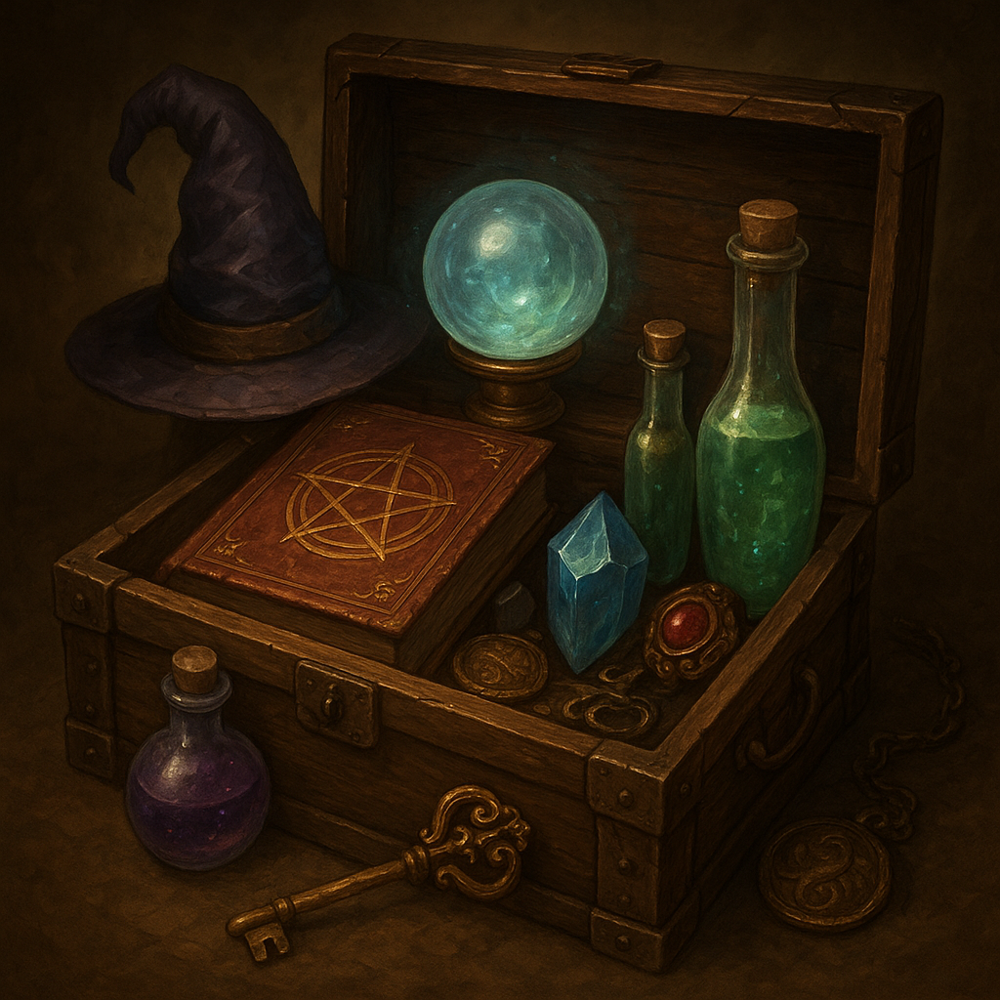

<h1>Magic Item Generator</h1>

Content library that allows users to randomize magic item loot selections in Avrae. This magic item generator allows administrators to customize which magic items can be rolled (with slight limitation). Initially without setup, this magic item generator only allows items that are from the Basic Rules (2014). Upon setup, you can have magic items from any sourcebook or even homebrew items.

[Table of Contents](https://github.com/Shadow-Draconic-Development/Avrae-Magic-Item-Generator/blob/main/ToC.md)

[Shadow's Main Website](https://shadow-draconic-development.github.io/.github/)

[Shadow's Discord Server](https://discord.gg/JqaH7Nbgmr)

## Help

To setup the alias, you simply need to go to [sub help](https://github.com/Shadow-Draconic-Development/Avrae-Magic-Item-Generator/blob/main/Code/sub/sub.md).

## License Notice
This work includes material written by Seth Hartman (aka ShadowsStride) and is licensed under the Creative Commons Attribution 4.0 International License available at https://creativecommons.org/licenses/by/4.0/legalcode.

## Requests
Requests can be made at this [link.](https://forms.gle/YYkyPcBb1WHXWMYE6)

All requests can be viewed at this [link.](https://docs.google.com/spreadsheets/d/1OyW78hh1ARDHeDu4hF4X2TxcpYSrrArprs8pkQB3zo4/edit?usp=sharing) All requests are viewable by all, if I have any problems I will restrict access to these links.

## Donations
You can click the button below to view my ko-fi and patreon page. Donations like this help me write more aliases and donators do get priority on feature requests.

 [Patreon](https://www.patreon.com/bePatron?u=47388431)